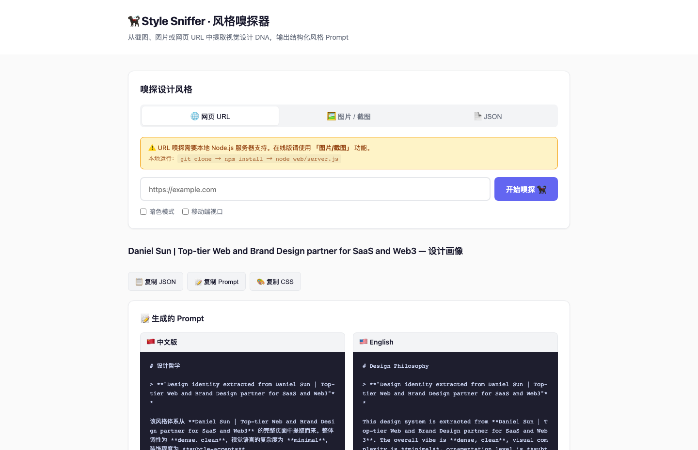
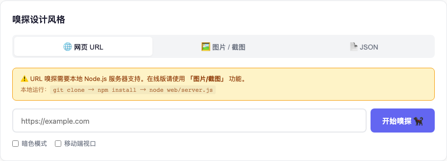
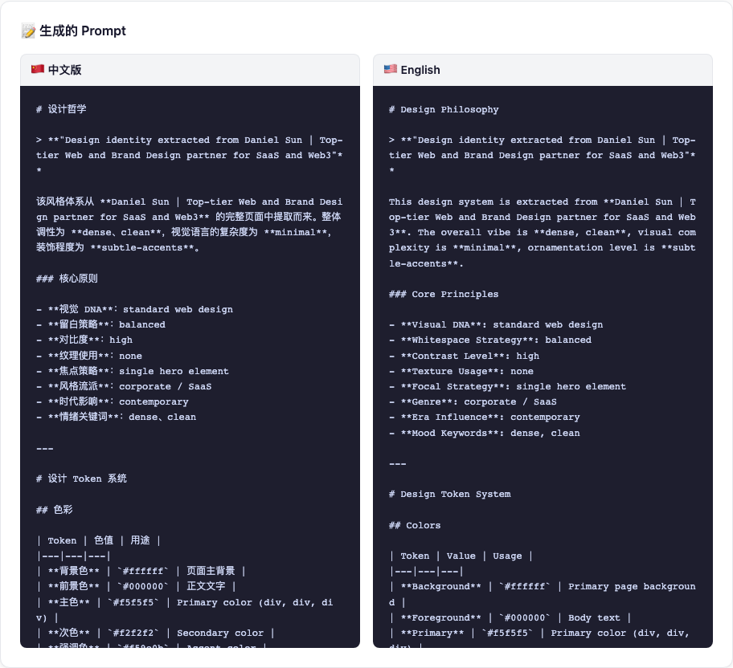
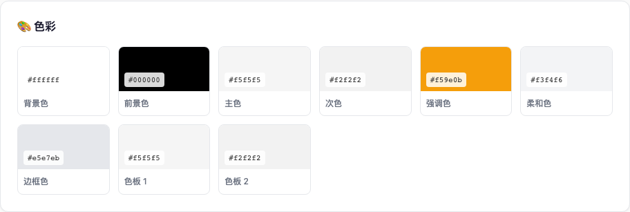
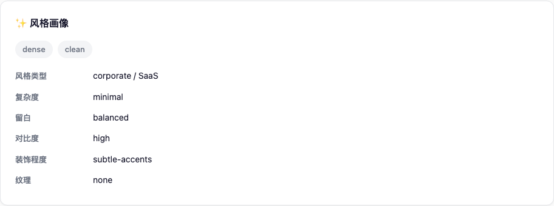
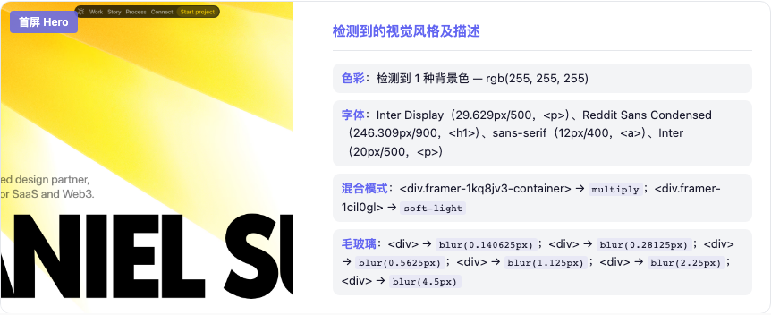

<h1 align="center">Style Sniffer · 风格嗅探器</h1>

<p align="center">
  <a href="README.md">English</a> | 中文
</p>

一个把网页、截图、图片里的视觉风格拆成结构化设计 DNA 的工具。它会提取色彩、字体、间距、圆角、阴影、组件气质和视觉特效，并生成可直接给 AI Agent / 前端生成器使用的风格 Prompt、JSON 画像与 CSS Token。

## 快速使用入口

想发给别人快速用，直接看：[快速给别人用](./QUICKSTART.zh-CN.md)

想让别人下载后自己本地运行，看：[给别人本地运行的超简单说明](./LOCAL_RUN_FOR_BEGINNERS.zh-CN.md)

在线图片版：

[https://cool-lamington-b047c4.netlify.app](https://cool-lamington-b047c4.netlify.app)

说明：在线版适合上传图片 / 截图分析；网页 URL / HTML 分析需要本地运行。

如果要使用完整的网页分析能力，建议用服务方式启动：

```bash
cd 自制工具/style-sniffer
npm install
npm run web
```

然后打开 `http://localhost:3000`。如果 `3000` 端口被占用，会自动尝试 `3001`、`3002` 等后续端口。

你也可以把它作为命令行工具使用：

```bash
npm install -g .
style-sniffer sniff example.com --save --prompt
```

常见使用方式有三种：

- 在线网页：适合上传图片 / 截图，并复制生成的 JSON / Prompt / CSS。
- 本地 Web：适合输入网页 URL，读取 HTML / CSS 并分析风格。
- 命令行 / Agent Skill：适合会用终端或 AI Agent 的人。



## 效果

- 从网页 URL、截图或图片中提取视觉设计 DNA
- 自动生成中英文双栏风格 Prompt，方便直接交给 Agent 复刻页面风格
- 输出结构化 JSON，保留可追溯的设计 Token 与风格判断
- 输出 CSS 变量，快速迁移色彩、字体、圆角、阴影和动效节奏
- 提供溯源证据：逐屏截图 + 每个区域检测到的字体、颜色、混合模式、滤镜、毛玻璃等特征
- 支持 CLI、Web UI、Agent Skill 三种入口

## 适合 / 不适合

适合：

- 分析一个网站、落地页、作品集或产品页的视觉语言
- 把参考截图整理成可复用的设计规范 / Prompt
- 为 AI Agent 生成页面、PPT、HTML Demo 前准备风格上下文
- 建立团队内部的风格资产库、案例库或设计 Token 记录

不适合：

- 不适合替代设计师的最终审美判断
- 不适合从低清、遮挡严重或信息很少的截图里推断完整设计系统
- 不适合直接处理需要登录、强风控或动态权限很重的页面

## 安装

推荐直接从 GitHub 下载项目：

```text
https://github.com/taiguoxiaoboluo/0516
```

下载并解压后，在项目目录里安装依赖：

```bash
npm install
```

要求 Node.js 18 或更高版本。

## 使用方式

### CLI

如果想使用 `style-sniffer` 命令，先在项目目录里安装成全局命令：

```bash
npm install -g .
```

```bash
# 从 URL 提取设计风格
style-sniffer sniff example.com

# 保存 JSON + Prompt 到 output/ 目录
style-sniffer sniff example.com --save --prompt

# 额外生成 CSS 变量
style-sniffer sniff example.com --save --prompt --css

# 仅输出原始 JSON
style-sniffer sniff example.com --json-only

# 使用移动端视口
style-sniffer sniff example.com --mobile

# 查看完整 Schema
style-sniffer schema

# 从已有 JSON 生成风格 Prompt
style-sniffer generate profile.json --format prompt
```

### Web UI

```bash
npm install
npm run web
```

浏览器打开 `http://localhost:3000`。

本地 Web UI 支持三种输入方式：网页 URL、图片 / 截图、已有 JSON。结果区可以一键复制 JSON、Prompt 和 CSS。



### Agent Skill

安装到你的 AI Agent：

```bash
npx skills add style-sniffer
```

然后对 Agent 说：

```text
提取 https://example.com 的视觉风格，并生成可用于 HTML 页面的风格 Prompt。
```

## 使用流程

| 阶段 | 输入 | 输出 | 说明 |
|---|---|---|---|
| Structure | 无 | Schema 字段说明 | 先定义风格画像应该包含什么 |
| Analyze | URL / 图片 / 截图 | Design Profile JSON | 提取颜色、字体、布局、组件、特效和视觉证据 |
| Generate | JSON + 内容目标 | Prompt / CSS / HTML | 将设计 DNA 转成可复用生产材料 |

## 产出长什么样

### 风格 Prompt

嗅探完成后会生成中英文双栏 Prompt，可直接复制给 AI Agent 或页面生成流程。



### 色彩与风格画像

Style Sniffer 会把原页面中的视觉信号归纳成调色板、风格标签、复杂度、留白策略和对比度策略。

| 色彩 Token | 风格画像 |
|---|---|
|  |  |

### 溯源证据

每段判断都尽量回到页面截图和 DOM/CSS 特征，让你知道“为什么它判断这个页面是这种风格”。



## 提取内容

| 维度 | 会提取什么 |
|---|---|
| 色彩 | 背景色、前景色、主色、次色、强调色、语义色、完整色板 |
| 字体 | 标题字体、正文字体、等宽字体、字号层级、字重、行高 |
| 间距 | 密度、节奏、基础单位、区块间距 |
| 形状 | 圆角层级、胶囊形态、边框策略 |
| 阴影 | 阴影层级、深度线索、扩散方式 |
| 组件 | 按钮、卡片、输入框、导航、页面区块 |
| 风格 | 情绪、流派、视觉语言、构图、留白、对比度 |
| 特效 | 滚动效果、光标效果、混合模式、滤镜、玻璃拟态、粒子等 |

## 目录结构

```text
style-sniffer/
├── bin/cli.js                  # CLI 入口
├── lib/
│   ├── extract/from-url.js     # URL 提取，基于 Playwright
│   ├── generate/
│   │   ├── to-prompt-md.js     # JSON -> 风格 Prompt
│   │   └── to-css-vars.js      # JSON -> CSS 变量
│   └── schema/                 # Schema 定义
├── references/
│   ├── schema.zh-CN.md         # 中文 Schema 文档
│   └── generation-guide.zh-CN.md
├── web/                        # Web UI
├── docs/
│   └── readme-assets/          # README 截图资源
├── SKILL.zh-CN.md              # Agent Skill 中文入口
└── package.json
```

## 核心原则

1. 先结构化，再生成：先把风格拆成 JSON，再进入 Prompt / CSS / HTML 生成。
2. 设计判断要可追溯：颜色、字体、阴影、滤镜等判断尽量有截图或 CSS 证据。
3. Token 优先：颜色、字体、圆角、阴影、间距应尽量被变量化。
4. Prompt 可执行：输出不是空泛审美词，而是能指导 Agent 落地页面的规则。
5. 保留风格，不复制内容：目标是复用视觉语言，不是搬运原网站文本和资产。

## License

MIT
